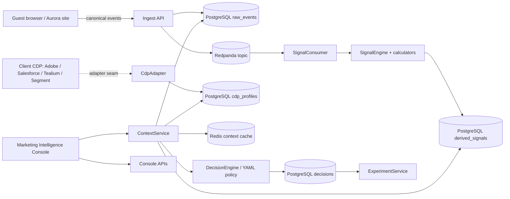

# Aurora architecture

Aurora is a fictional customer-intelligence accelerator for enterprise
Marketing teams. It operates beside a client's Adobe, Salesforce, Tealium, or
Segment CDP. The local CDP simulator is a provider-neutral development stand-in
so the showcase runs without a commercial licence; it is not a claim that
Aurora replaces the CDP.

## System context

## Components and extraction seams

| Module | Responsibility and current seam |
|---|---|
| `common` | Envelope, consent, profile, decision, and signal records. Extractable as versioned contracts. |
| `ingest` | Validation, quarantine, idempotent PostgreSQL write, Redpanda publication, and replay. Could become an ingestion service. |
| `cdp` | `CdpAdapter` and durable local simulator. Could become an adapter service or provider library. |
| `identity` | Explicit `CUSTOMER_IDENTIFIED` linking and timeline. Could become identity orchestration. |
| `signals` | YAML discovery, Spring calculator resolution, freshness, explanation, persistence, and lifecycle. Could become a signal worker/control plane. |
| `models` | Version registry, evaluation, approval/deploy/rollback, prediction explanation. Could become model registry/serving. |
| `decision` | Policy evaluation and decision persistence. Could become a low-latency decision API. |
| `experiments` | Stable assignment and persisted outcome measurement. Could become experimentation. |
| `context` | Context cache, session directory, funnel, operations, and delivery APIs. Could become a read/console backend. |
| `console-api` | Console module boundary; current endpoints are hosted by module-owned controllers. |
| `app` | Spring Boot composition, Flyway, health, OpenAPI, and runtime configuration. |

The Maven modular monolith keeps these boundaries visible without requiring
distributed deployment for the MVP.

## Event and decision flow

1. The site calls `POST /api/v1/events` through `frontend/lib/tracker.ts`.
   Each envelope contains event ID, event/receive times, schema version, source,
   session/identity IDs, correlation ID, consent, and typed payload.
2. `IngestService.ingest` accepts one envelope or a JSON array. It calls
   `EventCatalog.validate`, checks `EventRepository.exists`, writes
   `raw_events`, and publishes accepted events.
3. Invalid envelopes go to `quarantined_events` with original JSON and reason.
   Duplicate event IDs are acknowledged as duplicates and are not republished.
4. `DefaultEventPublisher` sends accepted events to Redpanda. `SignalConsumer`
   receives them and invokes `SignalEngine`.
5. `SignalRegistry` discovers `classpath:/signals/*.yaml` or the
   `AURORA_SIGNALS_LOCATION` override and resolves a Spring `SignalCalculator`.
   `SignalEngine` reads persisted session events, computes value, confidence,
   structured attributes, expiry, explanation, and provenance, then writes
   `derived_signals`.
6. `ContextService.forSession` reads Redis first. A miss reads PostgreSQL,
   calculates current signals, obtains the simulated CDP profile, and calls
   `DecisionEngine.decide`.
7. `DecisionEngine` evaluates priority-ordered `decision-policy.yaml` rules
   over structured attributes, value, confidence, and freshness. Missing
   personalization consent returns `STANDARD_WELCOME` with safe-default codes.
8. `DecisionRepository` stores the decision, inputs, policy version, action,
   experience, reason codes, and correlation ID. `ExperimentService` records an
   exposure when the decision has an experiment.
9. Outcome events are persisted by `ExperimentService.recordOutcome` and joined
   to exposures/decisions by `correlationId`.
10. `ContextMutationEvent` is published after accepted persistence.
    `ContextCache` evicts the session so later reads see current state.

The principal tables are `raw_events`, `quarantined_events`, `derived_signals`,
`cdp_profiles`, `identity_links`, `decisions`, `experiment_exposures`,
`experiment_outcomes`, `signal_lifecycle`, and `signal_lifecycle_audit`.

## Processing tiers and replay

- **Real time:** validation, raw-event write, broker publication, and cache
  eviction happen on the request path. Warm Redis makes context reads fast.
- **Near real time:** `SignalConsumer` persists derived snapshots. Context cache
  misses also calculate signals, keeping the demo useful during consumer delay.
- **Batch/replay:** `POST /api/v1/events/replay?sessionId=...` reads durable
  raw events and republishes them. PostgreSQL is the replay source, not broker
  storage.

## Scalability path

MVP bottlenecks are one application process, synchronous `JdbcTemplate` calls,
one PostgreSQL, session-wide recalculation on cache misses, one Compose
Redpanda node, and console queries over demo-sized tables.

| Stage | Concrete change |
|---|---|
| Pilot | Add tenant/session/time/correlation indexes, size pools, and monitor database/consumer throughput. |
| High volume | Partition raw events by tenant/time, partition Redpanda by stable subject/session, and scale consumers. |
| Decision scale | Separate Context/Decision APIs, retain hot profiles/signals in Redis, precompute historical features, and add read replicas/serving storage. |
| Measurement scale | Export facts to a warehouse and calculate aggregate funnel/experiment reporting asynchronously. |
| Enterprise isolation | Add tenant quotas/keys, regional processing, disaster recovery, and policy/schema governance. |

`consumerLagMs` is an approximation from persisted timestamps, not native
Kafka offset lag. The model drift metric is a basic comparison, not production
drift detection.

## Security, consent, and privacy

Analytics consent is stored with the raw event. Ingestion currently persists
the envelope regardless of personalization consent so analytics/quarantine/
replay remain observable. Personalization consent gates policy personalization:
absent consent returns `STANDARD_WELCOME`, `CONSENT_NOT_GRANTED`, and
`SAFE_DEFAULT`, and does not create an experiment exposure.

Customer ID, loyalty, consent, attributes, and identity links live in the
simulator's PostgreSQL tables. They are PII-like demo data. The repository does
not provide production encryption, deletion workflows, RBAC, secrets rotation,
tenant isolation, or field-level masking. Production must add those controls,
define retention/deletion contracts with the CDP, minimize payloads, audit
operator access, and map provider consent semantics through the adapter.

## Business problems and limits

| Problem | Mechanism | Honest MVP limit |
|---|---|---|
| Development/rollout time | YAML signal discovery, calculator beans, model registry/evaluation/deploy/rollback, lifecycle audit, and visible assumptions. | The 60% delivery figure is an assumption-derived target, not a measured commercial result. |
| Signal-to-decision time | Event → Redpanda → signal snapshot → Redis/PostgreSQL context → configured decision with correlation ID. | Compose-scale SQL and one process do not establish enterprise latency SLOs. |
| Incremental-value measurement | Stable assignments, exposure/outcome joins, funnel, and 30-subject guard. | Seed volume is synthetic; no significance claim is emitted and no production platform is integrated. |
