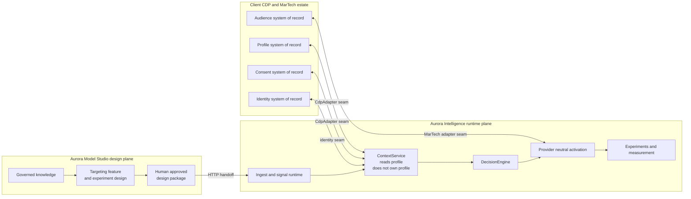
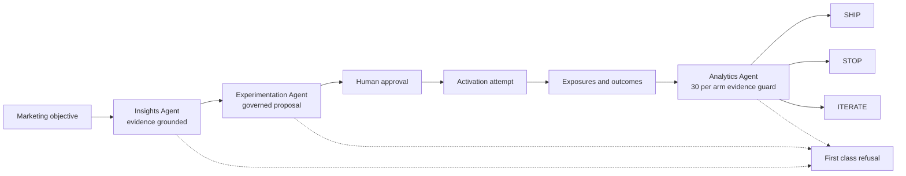
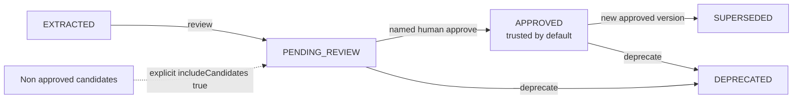
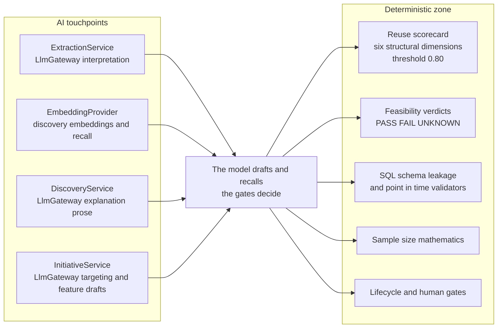
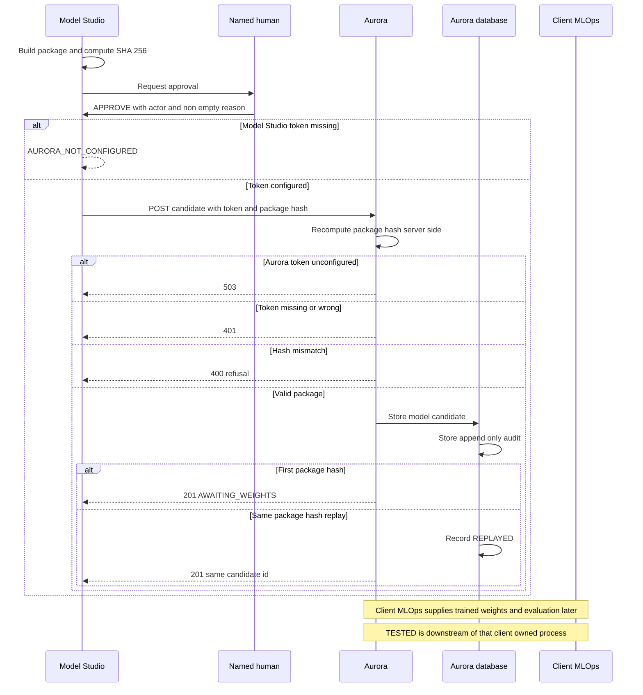

# Aurora Hotels capability guide

This is the sequenced walk through everything built for Aurora Hotels: what each
capability is, **why** it exists, **how** it is built, and **an Aurora Hotels use case**
for each. It is written to be read top to bottom by someone who has not seen the code,
and to survive a technical reviewer reading the code afterwards.

Use the context diagram for ownership, the runtime diagram for event-to-value flow,
the initiative diagram for gates, the AI boundary for model scope, the lifecycle
diagram for trust, the workforce diagram for agent governance, and the handoff
sequence for cross-repository delivery.

Aurora Hotels is fictional. No real hotel brand's trademark, branding, proprietary data,
or copyrighted material is used. Aurora works **beside** Adobe Experience Platform,
Salesforce Data Cloud, Tealium, Segment or any other CDP; it never replaces the
profile, consent, identity or audience system of record.

## The three problems everything here answers

1. Reduce customer-model and marketing-signal development and rollout time.
2. Reduce the time to turn a customer signal into an actionable marketing decision.
3. Measure whether models, signals and personalized actions create incremental value.

And one requirement that sits underneath all three: **explicit ownership** across the
CDP vendor, the implementation partner, our customer-intelligence team, client IT and
Marketing — mapped in [ownership-boundaries.md](ownership-boundaries.md).

## Two products, one loop



| | Aurora Intelligence (this repository) | Aurora Model Studio ([separate repository](https://github.com/mohangundappa/aurora-model-studio)) |
|---|---|---|
| Answers | problems 2 and 3 | problem 1 |
| Time horizon | runtime: milliseconds to days | development-time: requirement to approved design |
| Owns | events, signals, context, decisions, experiments, measurement | governed knowledge, reuse, targeting/feature design, experiment design, handoff |
| Stack | Java 21 / Spring Boot, PostgreSQL, Redis, Redpanda, Next.js console | Java 21 / Spring Boot, PostgreSQL + pgvector, provider-neutral LLM gateway |
| Ports | app `8080`, console `3000` | app `8081`, PostgreSQL `5433` |

They are deliberately separate products that meet over **one HTTP contract**, not a
shared build. The loop is:

```text
Marketing objective
  → Model Studio: what do we already know? what can be reused? is the data there?
  → Model Studio: governed targeting, features, experiment design
  → HANDOFF (human-approved, content-hashed design package)
  → Aurora Intelligence: candidate awaiting client-trained weights
  → client MLOps supplies weights + evaluation → a model version earns TESTED
  → Aurora Intelligence: signals → decision → personalized experience
  → exposures + outcomes → guarded analysis → SHIP / STOP / ITERATE
```

One rule shapes every design decision in both products, and it is worth saying before
anything else:

> **The LLM never decides a number, a threshold or a guard.** It recalls, ranks
> candidates by *retrieval*, explains and drafts. Every number, every classification
> that gates a decision, and every guardrail is deterministic and testable.

---

# Part I — Aurora Intelligence: signal to decision to measured value

## 1. A governed event contract instead of "track everything"

**Why.** Marketing analytics projects drown in DOM-click telemetry that no signal can
use. The expensive part of "find data" is not volume, it is meaning. So the first
capability is a *catalog*: a small set of canonical journey events, each with a declared
meaning, marketing value, producer, consumers, consent class and required payload.

**How.** `common/EventCatalog` validates one canonical envelope
(`eventId`, `eventName`, `eventTime`/`receivedTime`, `schemaVersion`, `source`,
`sessionId`, `anonymousId`, `customerId`, `correlationId`, `consent`, `payload`).
`ingest` validates, deduplicates on `eventId`, writes `raw_events`, and publishes to
Redpanda. Anything invalid goes to `quarantined_events` with the original JSON and a
reason — it is never silently dropped, and never counted as accepted. PostgreSQL, not
the broker, is the replay source: `POST /api/v1/events/replay?sessionId=...`.

**Aurora Hotels use case.** A guest searches *Miami*, picks dates, sets 2 adults +
2 children, filters for *resort*, opens a property, starts a booking and abandons.
That is six catalogued events — not two hundred clicks — and each one is there because a
named signal consumes it. See [event-catalog.md](event-catalog.md).

**Honest limit.** Ingestion stores the envelope regardless of the personalization
consent flag so analytics, quarantine and replay stay observable; personalization
consent is enforced later, per event, at signal calculation.

## 2. The CDP seam, identity and consent

**Why.** If the showcase pretended to *be* the CDP, none of it would transfer to a
client. The point is to be honest about the boundary and prove the seam.

**How.** `cdp/CdpAdapter` is a provider-neutral interface with a durable local
simulator behind it (`SimulatedCdpAdapter`) so the demo runs without a commercial
licence. `identity` performs explicit anonymous → known linking on
`CUSTOMER_IDENTIFIED` and keeps a timeline (`GET /api/identity/{anonymousId}/timeline`).
Consent is carried on every event; personalization consent is filtered **per event**, so
a later consent does not retroactively personalize earlier denied evidence, and absent
consent yields `STANDARD_WELCOME` with `CONSENT_NOT_GRANTED` / `SAFE_DEFAULT` and
records no experiment exposure.

**Aurora Hotels use case.** The anonymous browser above signs into their Aurora Hotels
account at booking. The session's prior evidence becomes attributable to the known
customer through one explicit link row with a correlation ID — the join a marketer
actually needs, without claiming to own the client's identity graph.

```mermaid
flowchart LR
  browser["Browser tracker<br/>frontend lib tracker ts"] --> api["Ingest API<br/>POST /api/v1/events"]
  api --> catalog["EventCatalog validation"]
  catalog --> |"valid"| raw[("raw_events")]
  catalog --> |"invalid"| quarantine[("quarantined_events<br/>reason and original JSON")]
  raw --> topic{{"Redpanda<br/>aurora events raw v1"}}
  topic --> consumer["SignalConsumer"]
  raw -.-> |"replay endpoint"| engine
  consumer --> engine["SignalEngine<br/>consent filter"]
  engine --> calculators["YAML calculators"]
  calculators --> derived[("derived_signals")]
  consumer --> cdp["SimulatedCdpAdapter"]
  cdp --> profile[("CDP profile<br/>consent and identity")]
  derived --> context["ContextService"]
  profile --> context
  context <--> redis[("Redis context cache")]
  context --> decision["DecisionEngine<br/>decision policy YAML"]
  decision --> decisions[("decisions")]
  decisions --> assignment["Experiment assignment"]
  assignment --> exposures[("experiment exposures")]
  decisions --> experience["Customer facing experience"]
  experience --> |"interaction events"| browser
  raw --> |"BOOKING COMPLETED<br/>joined by correlation ID"| outcomes[("experiment outcomes")]
  exposures --> measurement["Measurement<br/>lift and evidence guard"]
  outcomes --> measurement
  quarantine --> console["Console quality view"]
  measurement --> console
```



## 3. Signals as configuration, not code changes

**Why.** This is where problem 1 bites at runtime. In most estates, adding a marketing
signal means editing a central class, a release, and a regression cycle.

**How.** A signal is a YAML definition discovered from `classpath:/signals/*.yaml`
(or `AURORA_SIGNALS_LOCATION`) plus a Spring `SignalCalculator` bean resolved by
`SignalRegistry`. `SignalEngine` computes value (0–100), confidence, structured
attributes, expiry, explanation and provenance into `derived_signals`. Ten signals ship:
`destination-intent`, `family-travel-affinity`, `resort-affinity`,
`business-travel-affinity`, `amenity-preference`, `booking-intent`, `price-sensitivity`,
`abandonment-risk`, `journey-stage`, `weekend-getaway-affinity`. Each has a lifecycle
(`signal_lifecycle` + append-only audit) so rollout is governed, not ad hoc.

**Aurora Hotels use case.** `resort-affinity` reaches 70+ from resort filters and
property views; `family-travel-affinity` fires on a party with children. The policy in
§5 needs exactly those two, and adding a *weekend getaway* signal for a new campaign is
a YAML file plus a calculator bean — no central edit. See
[signal-catalog.md](signal-catalog.md).

**Honest limit.** The calculators are small MVP implementations. Reuse shortens
implementation; it does not remove data validation or model-risk review.

## 4. Customer context: session now, history behind it

**Why.** A decision needs both the live session and what is already known about the
person, and it needs it fast enough to serve a page.

**How.** `ContextService.forSession` reads Redis first; a miss reads PostgreSQL,
recalculates current signals, hydrates the simulated CDP profile, and calls the decision
engine. `ContextMutationEvent` evicts the session after accepted writes so the next read
is current. Redis failure degrades to PostgreSQL rather than failing the request.

**Aurora Hotels use case.** `GET /api/sessions/{id}/journey` returns the guest's
profile, recent behaviours, active signals with explanations, and the current decision —
the single payload a personalization surface or a CSR screen would consume.

## 5. Decisions as governed policy with reason codes

**Why.** "Next best action" is only trustworthy if a marketer can read *why*, and if the
rule is configuration a business owner can challenge rather than code.

**How.** `decision-policy.yaml` is priority-ordered rules over signal attributes,
value, confidence and freshness, each with an action, an experience, reason codes and an
explanation, optionally bound to an experiment. Every decision is persisted with its
inputs, policy version, reason codes and correlation ID — that correlation ID is what
later joins the decision to its outcome.

**Aurora Hotels use case.** `FAMILY_RESORT_RECOMMENDATION` requires
`resort-affinity ≥ 70` at confidence ≥ 0.50 and returns reason codes
`FAMILY_RESORT_EVIDENCE`, `RESORT_AFFINITY_ELIGIBLE`. `MIAMI_GETAWAY` requires
`destination-intent ≥ 60` with attribute `destination = Miami`. No eligible rule returns
`STANDARD_WELCOME` / `NO_ELIGIBLE_POLICY` — a *deliberate* default, not an error.

## 6. The customer-facing surface

**Why.** A personalization claim that only exists in JSON convinces nobody.

**How.** The Next.js app (`frontend/`) is a working Aurora Hotels site: anonymous
browsing, destination/date/party search, property and rate browsing, booking start,
abandonment and completion, login and account creation — all emitting the catalogued
events through `frontend/lib/tracker.ts`, and rendering the decision's experience.

**Aurora Hotels use case.** The same guest returns to the homepage and sees the
family-resort experience rather than the generic hero — and the console can show the
event, the signal, the rule, the reason codes and the exposure that produced it.

## 7. Experiments and incremental value

**Why.** Problem 3. Personalization without a control arm is an opinion.

**How.** Experiment definitions are database-backed with an enforced lifecycle
(`DRAFT` → deployed states, `V11`–`V17`) and **variant order preserved**. Assignment is
stable and deterministic per subject; `experiment_exposures` and `experiment_outcomes`
join to decisions by correlation ID. `Measurement` computes absolute and relative lift,
and a **30-subjects-per-arm evidence guard** withholds comparative claims below
threshold: `insufficientSample: true` instead of a flattering number.

**Aurora Hotels use case.** `destination-experience-v1` runs control against the
personalized destination experience. In the seeded reset: control 52 exposures /
5 outcomes (9.6%), personalized 48 / 7 (14.6%) — 5.0 points absolute, 51.7% relative,
guard met, recommendation **ITERATE**, because the observed difference did not clear the
significance threshold. The seed was deliberately *not* tuned to manufacture a winner.

## 8. The digital workforce: agents that are allowed to refuse

**Why.** The step that actually takes weeks in a marketing organisation is not the
model, it is the loop from objective to insight to a defensible experiment. That loop is
where agents help — and where an agent that invents a conclusion destroys the product.

**How.** `objectives` holds `MarketingObjective` (KPI, target, audience, lifecycle) and
measured `WorkflowStageTiming`s. `agents` holds three deterministic agents behind an
`AgentRuntime` seam (an LLM adapter is an extension point, not a hidden integration):

- **Insights Agent** — grounds findings in registered signals and reachable evidence
  references; refuses with codes such as `NO_RELEVANT_SIGNAL`,
  `NO_COMPARABLE_SIGNAL_GROUPS`, `NO_SESSIONS_IN_OBJECTIVE_WINDOW`.
- **Experimentation Agent** — drafts a two-arm proposal; refuses with
  `INSUFFICIENT_PROJECTED_TRAFFIC`, `MULTI_ARM_UNSUPPORTED`, `SIGNAL_NOT_REGISTERED`.
- **Analytics Agent** — reads exposures/outcomes and recommends SHIP / STOP / ITERATE;
  refuses with `INSUFFICIENT_SAMPLE`, `ZERO_EXPOSURES`, `NO_CONVERSIONS`,
  `ZERO_OBSERVED_EFFECT`, `RELATIVE_LIFT_UNDEFINED`.

Tools are an explicit read-only allowlist (`getCustomerContext`, `getKpi`, `getAudience`,
`getSignalDefinition`, `getExperimentPerformance`, `getExperimentExposures`,
`getExperimentOutcomes`). Every execution persists its tool calls, evidence references,
output or refusal snapshot, errors, correlation ID and measured latency. A **human
approval gate** (`V15`, `V18`) sits between proposal and activation, and the
version-controlled [agent evaluation suite](agent-evaluation.md) asserts the obligations
— evidence reachable, tools read-only, observations not stated as causation, insufficient
samples never recommended, refusals keep an exact code — against *any* runtime, so
swapping in an LLM does not lower the bar.

**Aurora Hotels use case.** Objective *Family traveler signal effect*
(KPI `BOOKING_COMPLETED`, target 0.20) produces a grounded insight, a two-arm proposal,
an audited approval, activation attempts, measured exposures and a guarded analysis. The
second seeded objective, *Explore an unsupported loyalty question*, produces a real
`NO_RELEVANT_SIGNAL` refusal: **a refusal is a governed outcome, not an empty result.**

**Honest limit.** Governance actors are `SELF_DECLARED_UNVERIFIED`. The audit is
attribution, not authorization; production needs client IT's SSO/RBAC in front of these
endpoints.



## 9. Provider-neutral MarTech activation

**Why.** Aurora must hand its decisions to whatever the client already runs, and the
failure behaviour must be visible rather than optimistic.

**How.** Three interfaces — `AudienceActivation`, `OfferDelivery`,
`CampaignRegistration` — with idempotency keys, opaque provider metadata, and durable
`activation_attempts` (`V19`, `V20`) recording accepted, rejected and partial results.

**Aurora Hotels use case.** Approving the family-resort proposal registers an `AUDIENCE`
and a `CAMPAIGN` attempt; every consented decision served records an `OFFER_DELIVERY`
attempt. The list is a running audit that grows during the walkthrough.

**Honest limit.** Simulated providers prove payload, idempotency and failure
representation only — not authentication, rate limits, asynchronous behaviour, data
residency or contract stability.

## 10. The console: watching the loop, not driving it

**Why.** Everything above must be inspectable by a marketer who does not read SQL, and
the surface must not be able to quietly change state during a demo.

**How.** `/console` is **read-only**: `workforce` (the causal strip: objective → insight
→ proposal → approval → activation → measurement → analysis → recommendation),
`experiments`, `funnel`, `lifecycle`, `ops` (ingest/quarantine counts and reasons,
decision latency, freshness distribution, component health, an explicitly approximate
consumer lag), and the delivery view.

**Aurora Hotels use case.** The 10–15 minute [demo script](demo-script.md) walks it
exactly as a client would see it, including where to say out loud that a number is a
local observation rather than commercial evidence.

---

# Part II — Aurora Model Studio: from requirement to an approved design

Part I shortens *rollout*. Part II attacks the part that actually consumes months:
deciding **what** to build, discovering it may already exist, and proving the data can
support it — with the evidence to defend every step.

## 11. Governed enterprise knowledge (the foundation, deliberately with no AI in it)

**Why.** Every later capability is only as trustworthy as the corpus it reads. So the
first phase contains no AI at all: versioned objects, evidence, lifecycle and tenancy.

**How.** `knowledge_objects` stores immutable logical versions of `MODEL`, `FEATURE`,
`DATA_ASSET`, `IMPLEMENTATION`, `EXPERIMENT`, `STANDARD`, each with evidence (source
system, URI, resolved commit, bounded excerpt, extraction certainty), relationships to
exact versions, conflicts, and a lifecycle:

```text
EXTRACTED → PENDING_REVIEW → APPROVED → SUPERSEDED | DEPRECATED
```

Only `APPROVED` knowledge is trusted; candidates require an explicit
`includeCandidates=true` opt-in. Approval requires evidence. Approved content is
immutable by database trigger, audit rows are append-only by trigger, and one approved
version per logical key is enforced by a partial unique index. Tenancy is enforced twice:
the `X-Aurora-Client` header populates `ClientContext`, and composite `(client_id, id)`
foreign keys make a cross-client reference fail *in the database*. Confidence is
**derived** from evidence and populated attributes with unknown signals excluded and
weights renormalized — an open conflict caps it at 0.5.



**Aurora Hotels use case.** `feature:resort-affinity` exists as an approved object with
its calculator implementation, the data assets it reads, the standards that govern it,
and the model that consumes it — so "what would we break?" is a bounded, cycle-safe
impact traversal rather than a meeting.

**What this design refuses.** A source artifact may *declare* `lifecycleStatus:
APPROVED` or a confidence value; those land only under `attributes.sourceDeclared` and
can never make a candidate trusted. This is exactly the hole a prompt-injected artifact
would aim for.

## 12. Backfill from the real estate, not an invented history

**Why.** A knowledge platform demoed on invented content proves nothing.

**How.** The importer reads an Aurora Intelligence checkout **in place** (never copying
it), hashes each artifact, and writes candidates whose evidence pins the source path and
resolved Git commit: signal YAMLs, calculator beans, the decision policy, experiment
definitions, the model-registry migration and curated documents. A re-run imports
nothing. A separate, visibly **watermarked synthetic** estate adds the near-duplicates
and deliberate contradictions a real legacy estate has, with `synthetic=true` present in
storage and in every retrieval package.

**Aurora Hotels use case.** 33 real Aurora artifacts plus the synthetic estate, with one
deliberate live contradiction — loyalty tenure defined in **months** in one place and
**years** in another — which later blocks a handoff, on purpose.

## 13. The LLM gateway: one boundary, provider-neutral, append-only

**Why.** If model calls are scattered, you cannot prove what was sent, what came back,
or that governance was not decided by a language model.

**How.** `LlmRequest` carries a task ID, versioned prompt template, resolved inputs, a
response JSON Schema, output limit, timeout and redaction policy; `LlmResult` is either a
schema-validated payload or an explicit refusal/failure — partially parsed output is
never exposed. The deterministic adapter is the default (byte-identical, keyless, used by
CI and the demo); OpenAI is opt-in via `studio.llm.provider=openai` + `OPENAI_API_KEY`
with structured output constrained by the schema. Artifact text is placed in an explicit
**data envelope** — content is data, never instructions — with credential-like values and
client UUIDs redacted. Every invocation is persisted (provider, model, prompt hash,
schema, tokens, cost, latency, retries, outcome) in append-only `llm_invocations`, and
every model-assisted candidate references its producing invocation.

**Aurora Hotels use case.** The interpretation of a resort-affinity calculator is
traceable to one invocation row and one prompt hash — the question an audit asks first.



## 14. Grounded extraction: two passes, and citations enforced

**Why.** "AI reads your codebase" is where these products usually start inventing.

**How.** Pass 1 is deterministic and reads only declared roots and shapes (with hard
exclusions for `node_modules`, `.git`, build output, lockfiles, generated sources,
workflows), recording identifiers, inputs, windows, referenced tables/columns, paths,
commit/content hashes and bounded excerpts — no model involved, certainty `1.0`,
provenance `EVIDENCE_BACKED`. Pass 2 lets the model propose descriptions, domains, use
cases, taxonomy and relationship hypotheses; **every retained interpreted field must cite
text actually present in an evidence excerpt**, or it is dropped. Interpreted fields carry
the configuration-owned certainty `0.72` — the model cannot choose its own score — and
extraction can only ever create `EXTRACTED` candidates.

**Aurora Hotels use case.** A destination-intent YAML plus its calculator becomes a
feature candidate whose *structural* facts (inputs, window, referenced columns) are exact,
and whose *business* interpretation is a cited hypothesis awaiting human approval.

**What went wrong first, and why it matters.** The first extraction pass crawled the repo
and minted 281 "knowledge" objects — `eslint-plugin-jsx-a11y` rule docs filed as
governance standards, CI workflows as features, four unrelated READMEs collapsed into one
object's four versions. That is precisely the failure this product claims to prevent, so
selection is now declared, unrecognised shapes are skipped, and skips are counted in the
run summary.

## 15. Discovery and reuse: rank by retrieval, decide by scorecard

**Why.** Problem 1's biggest lever is not building faster, it is **not building again**.

**How.** A persisted `ModelRequirement` is recalled against approved knowledge using the
union of pgvector nearest-neighbour and PostgreSQL full-text search — then a
**deterministic weighted scorecard** decides: target alignment 0.20, feature availability
0.16, data availability 0.14, population 0.12, horizon 0.10, implementation availability
0.10, evidence strength 0.10, execution evidence 0.08. Dimensions that cannot be derived
stay `null` and weights renormalize. `REUSE` requires **all six** structural dimensions
≥ 0.80; otherwise `ADAPT` with named gaps, or `GENERATE`. Blockers always precede the
score. Embedding provider identity is persisted because vectors from different providers
are not comparable. The LLM writes only the explanation.

**Aurora Hotels use case.** A requirement for a weekend-getaway propensity model returns
the existing `booking-intent` model and `weekend-getaway-affinity` feature as an `ADAPT`
with the specific gaps named — the reuse conversation, held over evidence.

## 16. Initiatives: the nine governed stages with human gates and measured timings

**Why.** The delivery-time claim has to be *observable*, and every acceleration must
still pass a gate.

**How.** An initiative walks:

```text
REQUIREMENT_INTAKE → KNOWLEDGE_DISCOVERY → REUSE_DECISION → DATA_FEASIBILITY
→ TARGETING_DESIGN → FEATURE_DESIGN → CANDIDATE_BUILD → EXPERIMENT_DESIGN → HANDOFF
```



```mermaid
flowchart LR
  intake["REQUIREMENT_INTAKE"] --> discovery["KNOWLEDGE_DISCOVERY"]
  discovery --> reuse["REUSE_DECISION<br/>human gate"]
  reuse --> data["DATA_FEASIBILITY"]
  data --> feasibility{"Feasibility"}
  feasibility --> |"PASS"| targeting["TARGETING_DESIGN"]
  feasibility --> |"UNKNOWN"| unknown["AWAITING_APPROVAL<br/>named human accepts"]
  unknown --> targeting
  feasibility --> |"FAIL"| blocked["BLOCKED"]
  targeting --> targetcheck{"Targeting validators"}
  targetcheck --> |"ACCEPTED"| feature["FEATURE_DESIGN<br/>human gate"]
  targetcheck --> |"REJECTED"| targeting
  feature --> candidate["CANDIDATE_BUILD<br/>OUT_OF_SCOPE"]
  candidate --> experiment["EXPERIMENT_DESIGN<br/>human gate"]
  experiment --> handoff["HANDOFF<br/>human gate"]
  handoff --> handoffcheck{"Handoff preconditions"}
  handoffcheck --> |"unapproved candidate"| refused["Refused"]
  handoffcheck --> |"all preconditions pass"| complete["Completed"]
```

with statuses `PENDING`, `IN_PROGRESS`, `AWAITING_APPROVAL`, `COMPLETED`, `BLOCKED`,
`PROVIDER_FAILED`, `REJECTED`, `NOT_IMPLEMENTED`, `OUT_OF_SCOPE`, and stage precedence
`any FAIL → BLOCKED`, else `any UNKNOWN → AWAITING_APPROVAL`, else `COMPLETED`. Stage
durations are measured, not asserted. **`CANDIDATE_BUILD` is permanently
`OUT_OF_SCOPE`**: Model Studio never trains a model — client MLOps does.

**Aurora Hotels use case.** The reuse initiative for family-resort personalization runs
end to end; the cancellation initiative stops honestly (§17).

## 17. Deterministic data feasibility, and unknowns a human must accept

**Why.** This is the single most common way these platforms lie: a green tick over data
nobody verified.

**How.** Feasibility checks are deterministic over governed metadata. An unverifiable
check is `UNKNOWN`, and `UNKNOWN` **never becomes a pass** — the stage sits at
`AWAITING_APPROVAL` until a named human explicitly accepts each named unknown.

**Aurora Hotels use case — the one to present.** The pilot requirement is *"predict which
confirmed resort bookings will cancel within 14 days of arrival, so we can trigger
retention offers."* Aurora has **no `BOOKING_CANCELLED` event**. The initiative therefore
blocks with:

```text
MISSING_TARGET_OBSERVABLE:BOOKING_CANCELLED
```

The deliverable is an *instrumentation gap*, not a model. A proxy target would be the
wrong answer, and the derivation is corpus-driven — an early version reached the same
verdict by matching the string `"CANCEL"`, which is a hardcoded special case dressed as
intelligence, and was removed.

Separately, the reuse initiative sits at `AWAITING_APPROVAL` with four honest `UNKNOWN`s
because Aurora's data assets declare grain and history as prose rather than comparable
values. That is better to show than a green tick.

## 18. Targeting and feature design: the model drafts, the validators decide

**Why.** Generated SQL is the highest-risk output in the product. Its value depends
entirely on the gates behind it being real.

**How.** Proposals go through the gateway; **every** proposal is retained with its
invocation reference and validator verdicts. Targeting SQL is parsed with JSqlParser and
checked against governed metadata: one read-only `SELECT`; tables and columns governed;
required cohort and as-of projections present; time predicates comparable to the as-of
parameter; and **target leakage** checked through `DERIVED_FROM` lineage, so a column
*derived* from the target is caught even when the target's name never appears. Generated
features enter as `EXTRACTED` candidates with `AI_GENERATED_HYPOTHESIS` provenance and
must pass human approval before anything trusts them; a near-duplicate of an approved
feature is reported for reuse instead of creating a second definition.

**Aurora Hotels use case.** With the real OpenAI provider the drafts failed the gates on
substance across seven runs — `WHERE event_time >= NOW() - INTERVAL '30 days'` instead of
bounding on the as-of parameter, missing required projections, and the prediction target
inside the cohort. That is the phase's claim *demonstrated* rather than asserted.

**Honest limits, stated because they are load-bearing.** Generated SQL is **never
executed** against client data — this is metadata validation, not an execution-based
verifier. Leakage through an ungoverned derivation is invisible to it. JSqlParser covers
only the PostgreSQL `SELECT` subset this demo needs. And a known false negative remains:
a human-readable spelling of a governed event (`'Booking Completed'` versus
`BOOKING_COMPLETED`) currently slips past identifier-exact leakage matching — the more
dangerous direction of error, and open.

## 19. Bounded experiment design, including the courage to output UNKNOWN

**Why.** A sample size derived from an invented baseline is the most persuasive lie a
tool like this can tell.

**How.** Deterministic validation: a governed primary outcome must be observable; exactly
one control and at least one treatment; unique nonblank variant names within Aurora's
120-code-point limit; positive integer allocations summing to 100; positive minimum
exposures. Minimum exposures come from a two-proportion calculation whose inputs are
named in the package (baseline rate, minimum detectable effect, alpha, power) — and with
baseline 0.10, MDE 0.02, alpha 0.05, power 0.80 the answer is **3841 per variant**, pinned
by test. Missing inputs produce `UNKNOWN`, never a plausible default, and the decision
rule is `UNKNOWN` too. A default 50/50 split is labelled `allocationSource: DEFAULT`
rather than passed off as designed.

**Aurora Hotels use case.** The seeded corpus contains no baseline conversion rate, so all
four inputs and the decision rule read `UNKNOWN`. The honest fix is a client-supplied
baseline, not a default.

## 20. The handoff: an immutable, content-hashed, human-approved design package

**Why.** This is where a knowledge platform either closes the loop into a runtime or
stays a wiki. It is also where fabrication is most tempting.

**How.** The package is immutable, recursively key-sorted, deterministically serialized,
SHA-256 hashed, and that hash **is** the idempotency key and the binding to the approval:
if any input changes after approval, the handoff refuses with
`PACKAGE_CHANGED_SINCE_APPROVAL`. Preconditions are all deterministic — targeting and
feature design completed, referenced generated features **approved**, feasibility and
experiment unknowns accepted, required observables present, a governed model name, and no
open blocking conflicts. Approval is explicit human governance: a named human actor and a
non-empty reason, with agent identities (including the orchestrator itself) refused, so
the system cannot approve its own gate. Every outbound attempt is persisted, and failures
are coded and contained: `AURORA_NOT_CONFIGURED`, `AURORA_UNREACHABLE`,
`AURORA_REJECTED`, `AURORA_RESPONSE_INVALID` — with **no local fake registration** if
Aurora is unreachable and no remote error text echoed back.

The package contains **no trained model, no weights, no evaluation, no expected lift** —
that exclusion list travels inside the package as `notIncluded`.

**Aurora Hotels use case.** The live walkthrough
([handoff-walkthrough.md](https://github.com/mohangundappa/aurora-model-studio/blob/main/docs/handoff-walkthrough.md))
opens on a **refused** handoff: the generated feature
`feature:generated:recent-session-engagement` is still an unapproved candidate, so
`FEATURE_NOT_APPROVED:...` blocks it and **no outbound attempt exists**. The presenter
then approves it live as a named human with a reason, and the handoff registers.

---

# Part III — The seam: what Aurora actually receives

**Status.** Shipped on `main` (`V22__model_candidates.sql`). A live cross-repo handoff
still needs both stacks running and the shared write token configured on each side.

**Why it is designed this way.** The original plan was to register the candidate into
Aurora's registry as `TESTED`. That is wrong and worth saying plainly: Aurora's registry
row is a scorer (features, weights, bias) and `TESTED` is a status a version earns by
having been **evaluated**. Model Studio never trains anything, so registering as `TESTED`
would mean inventing weights and implying an evaluation that never happened — a one-query
find for any technical reviewer.

**How.**

```text
POST /api/models/{name}/candidates
X-Aurora-Studio-Token: <shared write token>
Idempotency-Key: <packageHash>
→ 201 { candidateId, status: "AWAITING_WEIGHTS" }
```



Aurora stores it in `model_candidates` with `unique (model_name, package_hash)`
for idempotent replay and an append-only `model_candidate_audit` recording `REGISTERED` /
`REPLAYED`. A candidate is **not** a `model_versions` row: never servable, never in a
lifecycle transition, and `approve` / `deploy` / `rollback` / `evaluation` on a candidate
id all `404`. The invariant is pinned in the schema, not in prose —
`check (status = 'AWAITING_WEIGHTS')` — so `update model_candidates set status='TESTED'`
fails at the database. Aurora **recomputes** the package hash from the received body
before insertion and rejects a mismatch, and the write seam requires the shared token
(`401` wrong/missing, `503` unconfigured, never revealing the expected value).

**Aurora Hotels use case.** After the live approval: `201`, status `AWAITING_WEIGHTS`, a
replay returning the *same* candidate id, `model_versions` unchanged
(`booking-intent 1.0 DEPLOYED`, `2.0 TESTED`), and prediction still served by version
`1.0`. A design package arrived; a trained model did not.

**Why authentication and hash recomputation exist at all.** An adversarial test of the
live walkthrough inserted a *forged* candidate with a plain `curl` and no headers, and got
a `201` — it then appeared beside the governed candidate, disclaiming nothing. A second
probe sent a 6.2 MB fabricated body with a real `packageHash` and Aurora audited a
"replay" of a package it had never validated. Both are closed; both are the reason this
section is longer than it would otherwise be.

---

# Part IV — How this maps to the three claims

| Claim | What actually supports it | What it is not |
|---|---|---|
| Faster development and rollout | Reuse classification over governed knowledge; YAML signal + calculator discovery; database-backed experiment definitions; model registry with approve/deploy/rollback and audit; measured initiative stage timings | Not a measured commercial result. The delivery figure is derived from `app/src/main/resources/delivery-assumptions.yaml`, which covers exactly three activities: signal definition and validation (3→1 days), offline model evaluation (4→2), deployment and rollback (3→1) |
| Faster signal → decision | Event → Redpanda → signal snapshot → Redis/PostgreSQL context → configured policy decision with reason codes and correlation ID, all persisted | Compose-scale SQL in one process is not an enterprise latency SLO |
| Measured incremental value | Stable assignment, exposure/outcome joins by correlation ID, funnel, absolute/relative lift, 30-per-arm guard, guarded agent analysis that refuses on thin data | Seeded traffic is synthetic; no significance claim is emitted and no production platform is integrated |

**On the percentage.** Use it as a *planning target whose assumptions the client can
challenge and replace with their own baseline* — the assumption file is deliberately small
and readable for exactly that purpose. Anyone who presents it as measured commercial
outcome is overclaiming, and the numbers are checkable in one file.

---

# Part V — What we deliberately did not build

Stating these is part of the product's credibility, not a caveat section to skip:

- **No authentication or authorization anywhere in the showcase.** Governance actors are
  `SELF_DECLARED_UNVERIFIED` in Aurora and self-declared in Model Studio; the shared
  handoff token protects one write seam and is not an auth system. Production needs client
  IT's SSO/RBAC in front of every governance endpoint.
- **No real CDP integration.** The simulator proves the adapter seam, not a completed
  Adobe/Salesforce/Tealium/Segment implementation.
- **No model training.** `CANDIDATE_BUILD` is permanently out of scope; weights and
  evaluation are client MLOps.
- **No Model Studio console.** Its live approval is a `curl`, not a click.
- **No production data controls.** No encryption, deletion workflows, RBAC, secrets
  rotation, tenant quotas or field-level masking.
- **Known open gaps:** leakage matching misses a human-readable spelling of a governed
  event; there is no bounded repair loop feeding validator verdicts back to the model, so
  with the real provider targeting usually ends `BLOCKED`; OpenAI embeddings are not
  enabled because the column is `vector(32)` and `text-embedding-3-small` returns 1536
  with no embedding-model/version column to migrate against.
- **Text checks in the evaluation suites are regression tripwires, not proof.** A keyword
  scan cannot prove a sentence carries no causal implication.

---

# Appendix A — Running both

```bash
# Aurora Intelligence: console http://localhost:3000, API http://localhost:8080
docker compose up --build -d
./scripts/seed-demo.sh --reset

# Aurora Model Studio: API http://localhost:8081, PostgreSQL 5433
docker compose up --build -d
mvn -B -DskipTests package && ./scripts/reset-demo.sh   # destructive: recreates the volume
```

Model Studio requires `X-Aurora-Client` on every request. Model Studio reaches Aurora at
`STUDIO_HANDOFF_AURORA_BASE_URL` (Compose default `http://host.docker.internal:8080` with
a host-gateway mapping); the Java-level default `http://localhost:8080` fails closed from
inside the container.

# Appendix B — Where to look

| Topic | Document |
|---|---|
| Runtime architecture, tiers, scalability, security | [architecture.md](architecture.md), [data-flow.md](data-flow.md) |
| Event and signal contracts | [event-catalog.md](event-catalog.md), [signal-catalog.md](signal-catalog.md) |
| API surface | [api.md](api.md), `docs/openapi.yaml` |
| Value claims and their limits | [value-thesis.md](value-thesis.md) |
| Who owns what | [ownership-boundaries.md](ownership-boundaries.md) |
| Agent obligations | [agent-evaluation.md](agent-evaluation.md) |
| Presenting it | [demo-script.md](demo-script.md) |
| Inbound candidate seam | [data-flow.md](data-flow.md) |
| Knowledge, extraction, discovery, gateway | Model Studio `docs/knowledge-model.md`, `extraction.md`, `discovery.md`, `llm-gateway.md` |
| Targeting/feature design, experiment design, handoff | Model Studio `docs/targeting-feature-design.md`, `experiment-design-and-handoff.md`, `handoff-contract.md`, `handoff-walkthrough.md` |
