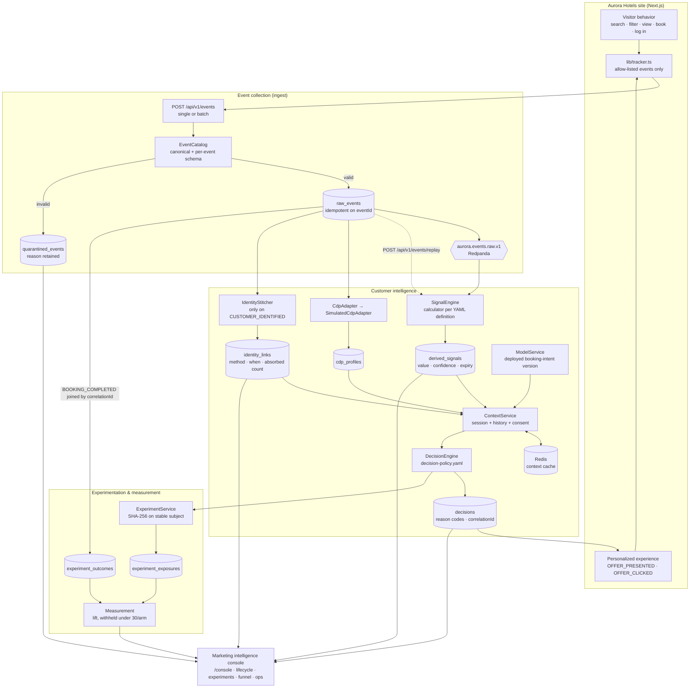
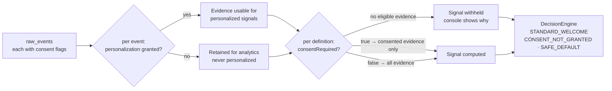
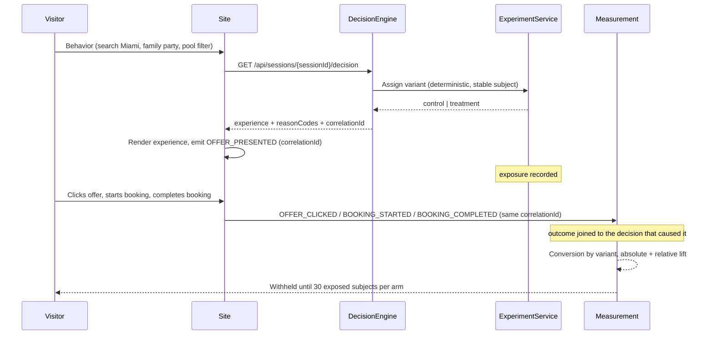

# Data flow

Three views of the same system, from coarse to specific. Every box names a real class,
endpoint, topic, or table in this repository, so the diagrams can be read against the code.

## 1. End-to-end data flow

How a browser action becomes a governed event, a signal, a decision, a rendered experience,
and finally a measured outcome.

Two properties worth reading off the diagram:

- **Collection is separate from calculation.** `raw_events` is the system of record; signals are
  derived from it, never in place of it. That is what makes the replay edge possible — the same
  events can be recomputed after a signal definition changes.
- **Nothing reaches the experience without a decision.** The site renders what
  `GET /api/sessions/{sessionId}/decision` returns, so the customer-facing change and the
  console's reason codes are the same object rather than two implementations of one rule.

## 2. Consent as a filter on the flow

Consent is evaluated **per event**, and per signal definition. A later `personalization: true`
event does not retroactively license evidence collected while consent was denied.

An event whose consent was denied is still collected and still auditable — it simply cannot
become a personalized signal. Denying consent therefore degrades to a safe default rather than
producing an empty screen with no explanation.

## 3. Decision → outcome, joined by correlation ID

This is the loop that answers "did the personalized action create incremental value?", and the
reason every decision carries a `correlationId` from the moment it is made.

The stable subject key stays the anonymous ID across identity stitching, so a visitor who logs
in mid-journey does not switch variants and invalidate their own exposure.

## Where the boundaries sit

The same flow, coloured by who owns each part in a real engagement — see
[ownership-boundaries.md](ownership-boundaries.md) for the full matrix.

| Stage in the flow | Owner in production |
| --- | --- |
| Event collection, profile store, identity resolution, audiences, consent record | CDP platform (Adobe, Salesforce, Tealium, Segment) |
| Schema configuration, source connections, destination setup | CDP implementation partner |
| Web properties, auth, booking systems, data platform hosting | Client IT |
| Signal framework, model lifecycle, context service, decisioning, measurement, console | Our customer-intelligence solution |
| Signal and offer definitions, experiment intent, reading the results | Marketing team |

In this MVP the first two rows are stood in for by `SimulatedCdpAdapter` behind the
provider-neutral `CdpAdapter` seam. It exists so the demo needs no commercial licence — it is
not a CDP replacement, and swapping in a real provider means implementing that one interface.
